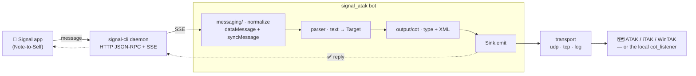

# signal-atak — a Signal bot that drops targets onto ATAK


Send a Signal message like `48.567123 39.87897 tank` and a marker appears on an
ATAK / iTAK / WinTAK map. The bot parses the coordinates and description, builds
a **Cursor-on-Target (CoT)** event, ships it to a TAK client, and replies in
Signal with a confirmation.


<p align="center"><em>Five Signal messages → CoT events → markers on the bundled local
listener (hostile = red). The listener is a full stand-in for the ATAK screen, so the
whole chain runs on a laptop with no phone or Android in sight.</em></p>

## Architecture



The bot depends only on two seams — a **`Messenger`** (chat backend) and a
**`Sink`** (target destination). Signal and CoT are just the implementations that
ship; each lives behind a registry, so a new platform or output format is one
module plus one registry line.

## Examples

Message format is two decimal numbers then a free-text description
(`<lat> <lon> <description>`, commas optional). The description maps to a CoT
type by keyword; these five were run end-to-end to produce the map above:

| Message (Signal) | CoT type | Marker |
|------------------|----------|--------|
| `48.567123 39.878970 tank` | `a-h-G-E-V-A-T` | hostile tank |
| `48.62 39.55 enemy APC near bridge` | `a-h-G-E-V-A-A` | hostile APC |
| `48.41 39.30 infantry squad` | `a-h-G-U-C-I` | hostile infantry |
| `48.75 38.95 supply truck` | `a-h-G-E-V-U` | hostile utility vehicle |
| `48.30 39.95 artillery battery` | `a-h-G-U-C-F` | hostile artillery |

Each message produces one CoT `<event>` and a Signal reply
(`✅ sent tank @ 48.567123, 39.87897 → …`). The exact XML for the first message:

```xml
<?xml version="1.0" ?>
<event version="2.0" uid="signal-demo-0001" type="a-h-G-E-V-A-T" how="m-g"
       time="2026-09-09T12:00:00.000Z" start="2026-09-09T12:00:00.000Z"
       stale="2026-09-09T12:10:00.000Z">
  <point lat="48.567123" lon="39.87897" hae="9999999.0" ce="9999999.0" le="9999999.0"/>
  <detail>
    <contact callsign="tank-0001"/>
    <remarks>48.567123 39.87897 tank</remarks>
  </detail>
</event>
```

See [`docs/demo/`](docs/demo/) for these artifacts and
[`docs/cot_protocol.md`](docs/cot_protocol.md) for the full type table and a field
-by-field CoT walkthrough.

## Approach

The pipeline is four small, independently testable steps:

1. **Parse** `text → Target(lat, lon, description)` with range validation and
   swapped-order detection (`parser.py`).
2. **Classify** the description into a CoT type code (`output/cot/types.py`),
   using the MITRE type catalog that ships with ATAK.
3. **Build** a spec-compliant CoT `<event>` XML document (`output/cot/encode.py`).
4. **Deliver** it to a `COT_URL` — multicast, TCP, UDP, or stdout
   (`output/transport.py` via `CotSink`) — and **reply** on the chat platform
   (`messaging/signal.py`, `bot.py`).

The two genuinely tricky parts are isolated as pure functions with heavy tests:
the Signal receive-path normaliser (the Note-to-Self quirk, below) and the CoT
builder. Everything that touches the network sits behind an interface so the
logic is tested without a phone, a TAK client, or a running daemon.

Tools used: Python 3.11+, `attrs`/`cattrs` (typed immutable models),
`defusedxml` (safe XML parsing), `folium` (the test map), `pytest`/`ruff`/
`black`, and `signal-cli` (external, via Homebrew) as the Signal bridge.
The design decision to use stdlib sockets instead of `pytak` is explained in
[`docs/challenges.md`](docs/challenges.md).

## Repository layout

```
src/signal_atak/
  parser.py            text → Target, with validation + swap detection
  config.py            env / .env configuration + platform/output selectors
  bot.py               main loop: receive → parse → sink.emit → reply
                       (depends ONLY on the Messenger + Sink protocols)
  __main__.py          python -m signal_atak (wires it up via the registries)
  messaging/           chat backends behind a common interface
    base.py            Messenger protocol + InboundMessage (platform-neutral)
    signal.py          signal-cli HTTP/JSON-RPC + SSE, incl. sync transcripts
    factory.py         name → Messenger registry (build_messenger)
  output/              target destinations behind a common interface
    base.py            Sink protocol: emit(Target)
    transport.py       byte transports for a COT_URL (udp/tcp/log)
    cot_sink.py        CotSink = CoT-encode + transport
    factory.py         name → Sink registry (build_sink)
    cot/
      types.py         description → CoT type code (MITRE catalog)
      encode.py        Target → CoT XML; also parse_cot for the listener
tools/cot_listener.py  local CoT listener + folium map (a fake TAK client)
tools/clear_map.py     retract emitted markers (CoT delete) to clear the map
tests/                 pytest suite (parser, cot, types, config, transport,
                       cot_sink, signal, bot)
docs/                  cot_protocol.md, challenges.md
```

### Adding a platform or output

- **New chat platform:** add `messaging/<name>.py` with a class implementing
  `Messenger` (its `receive()` yields `InboundMessage`, `send()` posts a reply),
  then register it in `messaging/factory.py`. Select with `MESSAGING_PLATFORM`.
- **New output format:** add a `Sink` (or reuse `CotSink` with a new transport),
  register it in `output/factory.py`, select with `OUTPUT_SINK`.

## Setup

### 1. Python environment

```bash
python3.12 -m venv .venv
source .venv/bin/activate
pip install -r requirements.txt        # runtime deps
pip install -e ".[dev]"                # + pytest/ruff/black for development
```

Or with the Makefile: `make venv && make install`. `make help` lists every
shortcut (`test`, `lint`, `format`, `check`, `listener`, `run`).

Run the tests — this passes with **no** phone, daemon, or TAK client:

```bash
pytest            # 97 tests, all offline    (or: make test)
```

### 2. Link signal-cli to your Signal account

The bot uses your **existing** account as a **linked device** (no new number, no
captcha). Install a current signal-cli — 0.14.x or newer; older builds stop
working against Signal's servers:

```bash
brew install signal-cli
signal-cli link -n "atak-bot"
```

`link` prints a QR code in the terminal (0.14.0+). On your phone:
**Signal → Settings → Linked Devices → +** and scan it. Wait for the command to
finish; it prints your account number when linking completes.

### 3. Start the signal-cli daemon

```bash
signal-cli -a +YOURNUMBER daemon --http=127.0.0.1:8080 --receive-mode=on-connection
```

This exposes the JSON-RPC HTTP API the bot talks to (`POST /api/v1/rpc` to send,
`GET /api/v1/events` SSE stream to receive). Leave it running.

`--receive-mode=on-connection` is important: without it, signal-cli's default
(`on-start`) pulls and acknowledges messages from Signal's servers even when no
client is listening — so anything that arrives while the bot is reconnecting or
down is acked to nobody and lost. `on-connection` makes the daemon fetch only
while the bot's SSE stream is attached, so messages queue server-side across
disconnects. See [`docs/challenges.md`](docs/challenges.md).

### 4. Configure and run the bot

```bash
cp .env.example .env      # then edit SIGNAL_ACCOUNT and COT_URL
python -m signal_atak
```

## Run & demo

You can demo the whole chain **without a TAK device** using the bundled listener.

**Terminal A — the fake TAK client:**
```bash
python tools/cot_listener.py --tcp 127.0.0.1:4242
# open cot_map.html in a browser; it refreshes as markers arrive
```

**Terminal B — the bot, pointed at the listener:**
```bash
COT_URL=tcp://127.0.0.1:4242 python -m signal_atak
```

Now send yourself `48.567123 39.87897 tank` in Signal (Note-to-Self). You should
see the listener log the CoT, a pin appear in `cot_map.html`, and a `✅` reply
in the chat.

Prefer to eyeball the raw protocol? `COT_URL=log://stdout python -m signal_atak`
prints the CoT XML for each message.

### Clearing the map

The bot records every marker it emits, so you can wipe them all — from the TAK
client *and* the local listener — before a fresh demo or recording:

```bash
python tools/clear_map.py                          # to the default multicast group
python tools/clear_map.py --cot-url tcp://<ip>:4242  # to an iTAK TCP input
# make clear     # same thing (pass COT_URL=… to override the target)
```

It sends a CoT **delete** (`t-x-d-d`) for each emitted marker's uid — the
standard TAK retraction — then resets the tracking file.

### Delivering to a real iTAK / WinTAK

Two routes, both documented so you can pick what your network allows:

- **Multicast (try first):** `COT_URL=udp://239.2.3.1:6969`. This is the ATAK/iTAK
  default SA mesh group; on the same Wi-Fi it often works with no client config.
  Some routers drop multicast (IGMP snooping, AP client isolation) — if the
  marker never shows, use the TCP route.
- **TCP unicast (reliable):** add a network input in iTAK
  (**Settings → Network → Inputs/Outputs**) or WinTAK for TCP on a port, then set
  `COT_URL=tcp://<device_ip>:<port>`. This crosses routers that block multicast.

### Live demo (real device)

The map above is the local listener — a faithful stand-in for ATAK. For a
screenshot of the real chain (a Signal Note-to-Self message and its marker on an
actual iTAK map), follow [`docs/demo/CAPTURE.md`](docs/demo/CAPTURE.md). It walks
through the two shots and, importantly, how to redact your phone number before
committing to a public repo:

- `docs/demo/signal_chat.jpg` — the Signal chat: the sent target and the `✅` reply.
- `docs/demo/itak_marker.jpg` — the marker on the iTAK map.

## Key decisions & assumptions

- **Coordinate order is `lat lon` by default.** The assignment example labels
  `48.567123 39.87897` as *(longitude, latitude)*, but 48.5° can only be a
  latitude and 39.9° a longitude for the region described — the label is a typo.
  Set `LON_FIRST=true` to honour the literal spec order. Out-of-range-looking
  input is warned about, never silently reordered.
- **Note-to-Self testing** means the bot reads its own sent messages via Signal
  **sync transcripts** (`syncMessage.sentMessage`), not ordinary incoming
  messages — see [`docs/challenges.md`](docs/challenges.md). This is the central
  quirk of the design.
- **Affiliation defaults to hostile (`h`)** — the domain is targets. Configurable.
- **hae/ce/le = `9999999.0`** (CoT "unknown"), since a text has no altitude/accuracy.
- **stale = 10 minutes**, **uid = `signal-<uuid4>`** (a fresh marker per message).
- **signal-cli is a linked device** of your existing account, not a new number.

## Limitations

- One target per message; no attachments, groups, or media.
- signal-cli must be linked and its daemon running — the bot does not manage it.
- Multicast delivery depends on the local network; TCP is the reliable fallback.
- iTAK/WinTAK accept legacy XML CoT on a plain input; a full TAK Server
  (protobuf/TLS) is out of scope.

## Troubleshooting

| Symptom | Likely cause / fix |
|---------|--------------------|
| Bot silent to your messages | You're on Note-to-Self and messages arrive as sync transcripts — this bot handles that; check the daemon is up (`GET /api/v1/check`) and `SIGNAL_ACCOUNT` matches. |
| `signal-cli daemon not reachable` | Start `signal-cli -a … daemon --http=127.0.0.1:8080 --receive-mode=on-connection` and check the port matches `SIGNAL_HTTP`. |
| Messages lost after a bot restart/reconnect | The daemon was started without `--receive-mode=on-connection` — see step 3 and `docs/challenges.md`. |
| Marker never appears in iTAK | Multicast dropped by the router — switch to `COT_URL=tcp://<device_ip>:<port>` and add the input in iTAK. |
| `link` seems to hang | It waits until you scan the QR; don't kill it before then. |
| Nothing on the map | Confirm the listener printed the CoT line; open/refresh `cot_map.html`. |
