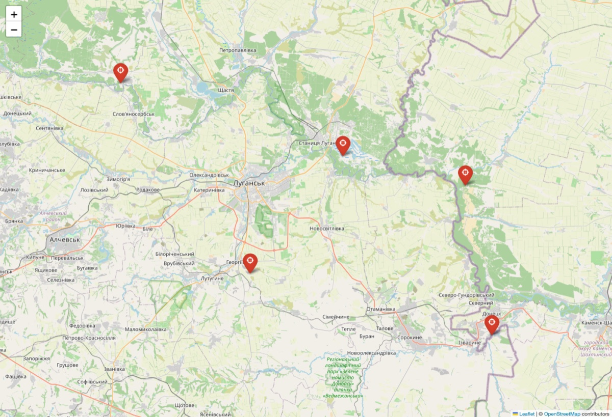

# Demo artifacts

Generated by running the full pipeline locally (no phone, no ATAK device),
sending five sample Signal messages through the bot into the bundled
`cot_listener`.



*Five targets delivered as Cursor-on-Target and rendered on the local listener's
folium map (hostile = red). This is the local stand-in for the ATAK screen.*

| Message (Signal) | CoT type | Meaning |
|------------------|----------|---------|
| `48.567123 39.878970 tank` | `a-h-G-E-V-A-T` | hostile tank |
| `48.620000 39.550000 enemy APC near bridge` | `a-h-G-E-V-A-A` | hostile APC |
| `48.410000 39.300000 infantry squad` | `a-h-G-U-C-I` | hostile infantry |
| `48.750000 38.950000 supply truck` | `a-h-G-E-V-U` | hostile utility vehicle |
| `48.300000 39.950000 artillery battery` | `a-h-G-U-C-F` | hostile artillery |

Files:

- **`map_screenshot.jpg`** — the rendered map above (screenshot of `cot_map.html`).
- **`cot_map.html`** — the interactive folium map the listener wrote; open it in a
  browser to pan/zoom and click the markers.
- **`sample_cot.xml`** — the exact CoT `<event>` XML the bot emits (pretty-printed),
  for the first message.
- **`listener.log`** — the listener's console output, one line per received CoT
  plus each map update.

To reproduce:

```bash
python tools/cot_listener.py --tcp 127.0.0.1:4242 --map cot_map.html   # terminal A
COT_URL=tcp://127.0.0.1:4242 python -m signal_atak                     # terminal B
# then send yourself the messages above in Signal (Note-to-Self)
```

For delivery to a real iTAK/WinTAK instead of the listener, point `COT_URL` at
the device — see the main README's "Delivering to a real iTAK / WinTAK".
